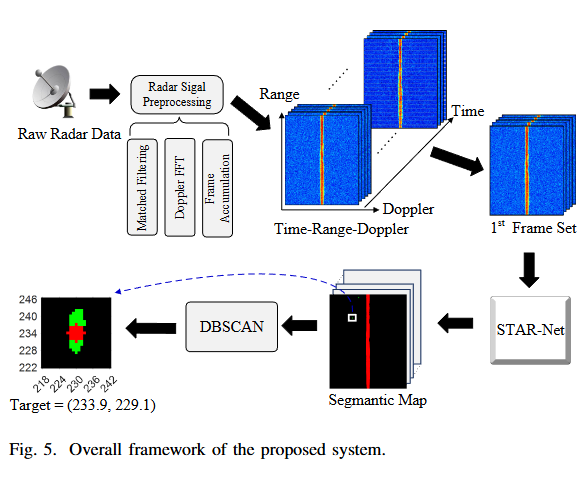

# A Spatio-Temporal Attention Refinement Network for Fluctuating Target Detection in Sky-Wave Over-the-Horizon Radar

**Junjie Xie**1,* · **Zhongtao Luo**1,+,✉️ · **Kun Lu**2 · **Zhiling Li**1 · **Zihan Li**1 · **Shengnan Shi**3

1CQUPT&emsp; 2NRIET&emsp; 3NJUPT  
 
*First Author&emsp; †Project Leader&emsp; ✉️Corresponding Author

This work presents **STAR-Net**, a novel multi-view DL-based approach for fluctuating target detection in sky-wave over-the-horizon radar systems using spatio-temporal attention refinement module.

## Usage
code will release soon.

## 🙏 Acknowledgements
- The paper is currently under review. Special thanks will be indicated after final results.
- Thank [MVRSS](https://github.com/valeoai/MVRSS) for providing the basic model network foundation.
- Thank Jixuan Li and the experts from Nanjing Research Institute of Electronics Technology (NRIET) for the time-range-Doppler dataset construction.
