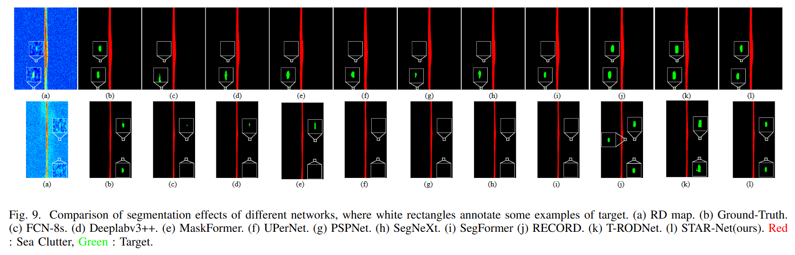
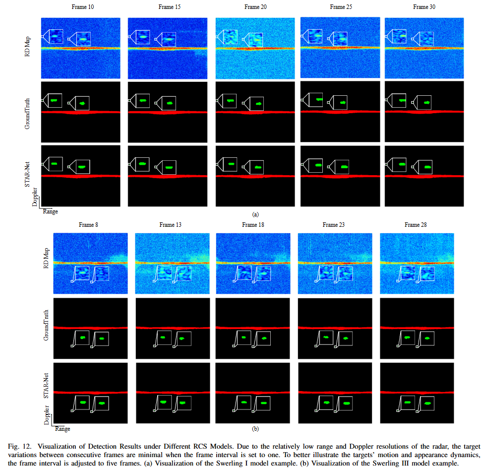
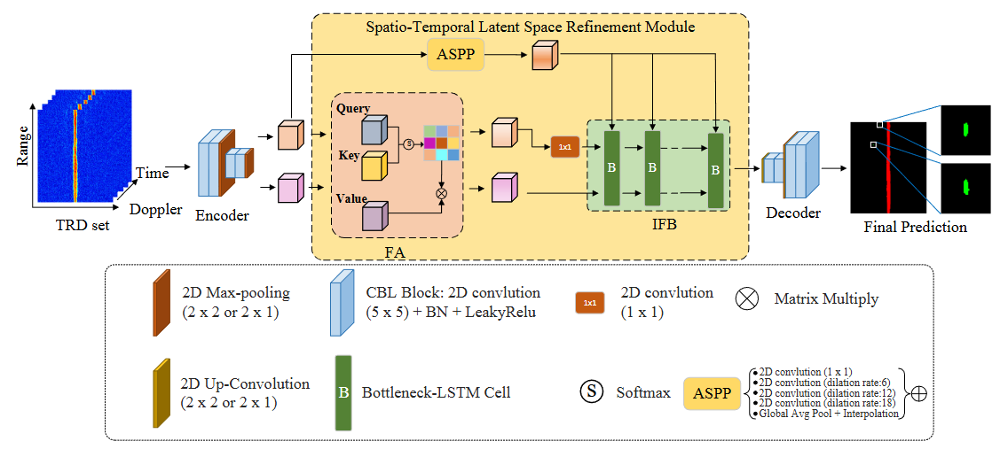

<div align="center">

# A Spatio-Temporal Attention Refinement Network for Fluctuating Target Detection in Sky-Wave Over-the-Horizon Radar

**Junjie Xie**<sup>1,*</sup> · **Zhongtao Luo**<sup>1,+,✉️</sup> · **Kun Lu**<sup>2</sup> · **Zhiling Li**<sup>1</sup> · **Zihan Li**<sup>1</sup> · **Shengnan Shi**<sup>3</sup>

<sup>1</sup>CQUPT&emsp; <sup>2</sup>NRIET&emsp; <sup>3</sup>NJUPT  
<br>
*First Author&emsp; †Project Leader&emsp; ✉️Corresponding Author

</div>

This work presents **STAR-Net**, a novel multiframe DL-based approach for fluctuating target detection in sky-wave over-the-horizon radar systems using spatio-temporal attention refinement module.

<div align="center">

</div>

<div align="center">

</div>

<div align="center">

</div>


<!-- ## 📋 Table of Contents

- [Environment Setup](#1-environment-setup)
- [Dataset Preparation](#2-dataset-preparation)
- [Sample Dataset](#3-sample-dataset)
- [Usage](#4-usage)
  - [Training](#41-training)
  - [Testing](#42-testing)
  - [Inference](#43-inference)
- [Acknowledgements](#Acknowledgements)
- [Citation](#citation) -->

---

## 1. Environment Setup

For detailed installation instructions, please refer to [Installation Guide](./doc/install.md).

## 2. Dataset Preparation

Configure dataset paths in `mvrss/config_files/config.ini`. Two dataset types are supported:

### Carrada Dataset (Multi-frame & Multi-view)
Dataset structure:
```
${data_path}/
└── Carrada/
    ├── ${time1}/
    ├── ${time2}/
    └── ...
```

Configuration:
```ini
warehouse=${data_path}
```

### OTHR Dataset (Time-Range-Doppler)
Dataset structure:
```
${othr_data}/
├── train/
│   ├── ${time1}/
│   ├── ${time2}/
│   └── ...
├── val/
│   └── ...
└── test/
    └── ...
```

Configuration:
```ini
warehouse=${othr_data}
```
Due to the confidentiality of the dataset, we cannot open source it completely. We have open sourced a part of it, available at [Google Drive](https://drive.google.com/drive/folders/1UQBs6HTbl2ckQ6tTC9Ndoj8WQwCtf9yv?usp=drive_link).


## 3. Usage
### 3.1 Training

1. Configure your parameters by referring to the [Parameter Table](doc/parameters.md), reference file `starnet.json` at dir `starnet/config_files`.
2. Run training:
```bash
python tools/train.py --cfg config_files/starnet.json
```

**Resume Training:**
```bash
python tools/train.py --cfg config_files/starnet.json --resume --ckpt ${checkpoint_path}
```

> **Note**: Use `state.pt` as checkpoint, not `model.py`. Example:
> ```bash
> python tools/train.py --cfg config_files/starnet.json --resume --ckpt /root/autodl-tmp/MVRSS/logs/othr/starnet/starnet_e450_lr0.0001_s42_2/results/last_state.pt
> ```

### 3.2 Testing

Test with existing models:
```bash
python tools/val.py --cfg logs/othr/starnet/starnet_e450_lr0.0001_s42_3/config.json
```

### 3.3 Inference

Set your input dataset dir `${input_dir}`, infer with existing models:
```bash
python tools/demo.py --cfg logs/othr/starnet/starnet_e450_lr0.0001_s42_3/config.json \
--ckpt logs/othr/starnet/starnet_e450_lr0.0001_s42_3/results/best_state.pt \
--input-dir ${input_dir}
```


---

## 🙏 Acknowledgements

- The paper is currently under review. Special thanks will be indicated after final results.
- Thank [MVRSS](https://github.com/valeoai/MVRSS) for providing the basic model network foundation.
- Thank the experts from Nanjing Research Institute of Electronics Technology (NRIET) for the time-range-Doppler dataset construction.

---

## 📧 Contact
For questions and collaboration opportunities, please contact the corresponding author: **Zhongtao Luo** ✉️.
